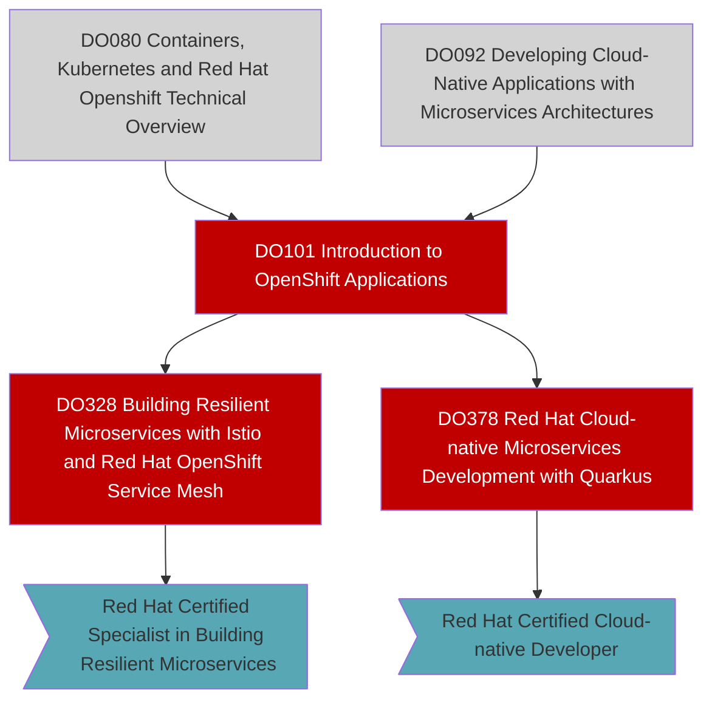

# Learning Path Documentation

You can use this example if you want to get really fancy and take advantage of [material ui](https://squidfunk.github.io/mkdocs-material/) (the tool tip below plus extra stuff). And (meirmaid)[https://mermaid-js.github.io/mermaid/#/flowchart?id=graph] (the graph)

!!! tip
    Nodes are clickable links leading to more learning!!!

!!! info
    Colors can be found [here](https://www.w3schools.com/colors/colors_shades.asp)

